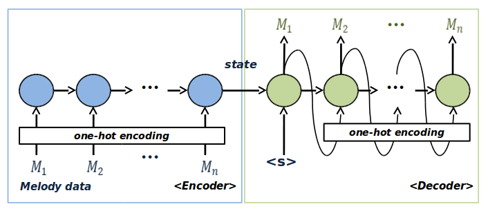

RNN Auto-Encoder
================
Paper: [Kim, K.H.; Jung, S.H. Automatic Composition using Time Series Embedding of RNN Auto-Encoder. J. Korea Multimed. Soc. 2018, 21, 849–857.](https://koreascience.kr/article/JAKO201829562509737.page)

I study RNN & RNN autoenc and code with tensorflow.  
I use data which is music melody data from **midi file**.

### Contents

1.	basic RNN
2.	RNN Auto-Encoder(LSTM Auto-Encoder) (reference : https://arxiv.org/abs/1502.04681)

### Description

**1. basic RNN**

-	I implemented the basic RNN structure in tensorflow code.

**2. RNN Auto-Encoder**

-	I implemented the RNN Auto-encoder structure in tensorflow code.
-	It consists of an RNN encoder and a RNN decoder.  
-	The final state of the encoder serves as the compressed space of general auto encoder.  
-	Input of decoder is learning data sequence when learning, but output returns to input when it is used for output.

	##### code

	-	Model (*Still editing now*\)
		-	RNN_AE_model_decoder_dynamic : model using dynamic rnn in tensorflow
		-	RNN_AE_model_decoder_feedback : model using cell with `for` loop
		-	train : train model
		-	test : generate new sequence using trained model
		-	util : utility code

